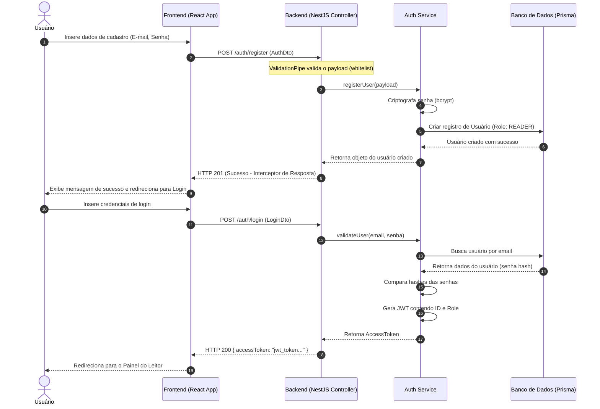
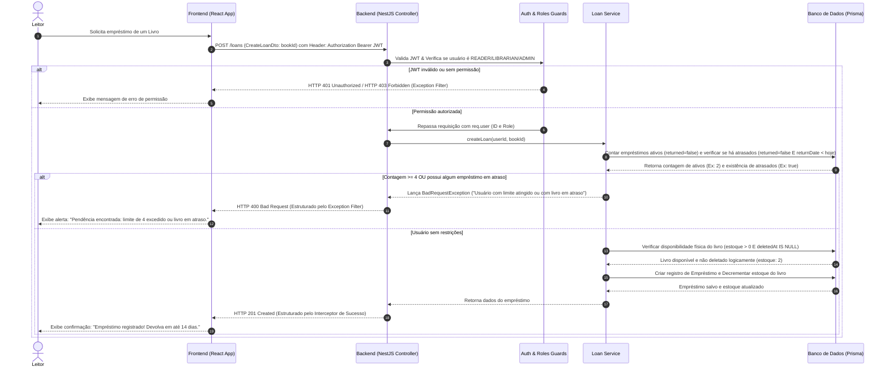
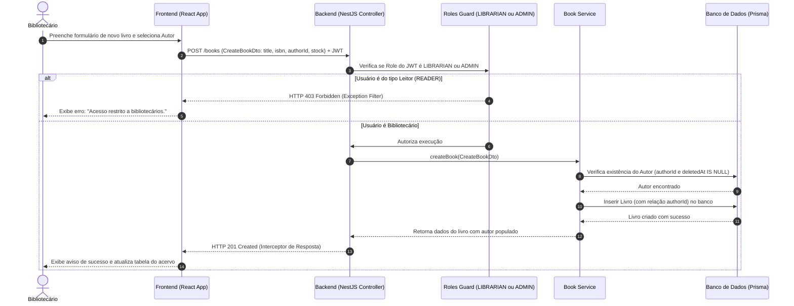

# Documento de Requisitos de Produto (PRD) - BookStore Library

## 1. Visão Geral do Produto
O **BookStore Library** é um sistema de gerenciamento de biblioteca universitária projetado para digitalizar e automatizar os processos de catalogação de livros, cadastro de usuários, controle de permissões e circulação do acervo (empréstimos e devoluções). O sistema visa simplificar o dia a dia dos bibliotecários e oferecer uma interface intuitiva para que os estudantes (leitores) localizem e reservem obras literárias de forma ágil e segura.

### Objetivos do Sistema
- **Controle de Circulação Rigoroso**: Evitar perdas de livros e garantir a rotatividade do acervo através de restrições automatizadas (ex: limite de até 4 empréstimos ativos por usuário).
- **Garantia de Segurança**: Proteger dados cadastrais de usuários e restringir acessos a endpoints administrativos com base em perfis de acesso.
- **Eficiência e Padronização**: Disponibilizar uma API rápida, documentada com Swagger e que trate falhas de forma padronizada.

---

## 2. Perfis de Usuário (Roles)
O sistema opera sob o modelo de Controle de Acesso Baseado em Papéis (RBAC - Role-Based Access Control) com três perfis principais:

1. **Leitor (Patron/Reader)**:
   - Perfil padrão para estudantes e professores.
   - Permissões: Consultar o catálogo de livros, visualizar seu próprio histórico de empréstimos e solicitar empréstimos (respeitando o limite de no máximo 4 empréstimos ativos simultâneos e sem pendência de empréstimos em atraso).
2. **Bibliotecário (Librarian)**:
   - Perfil operacional da biblioteca.
   - Permissões: Cadastrar, atualizar e excluir (via Soft Delete) livros/autores no acervo, gerenciar empréstimos (aprovar, registrar devolução) e gerenciar perfis de Leitores.
3. **Administrador (Admin)**:
   - Perfil de controle total.
   - Permissões: Acesso irrestrito a todos os recursos do sistema, gerenciamento completo de usuários (incluindo alteração de papéis/roles) e visualização de logs/auditorias.

> [!NOTE]
> **Inicialização do Sistema (Seed)**: Como a rota pública de registro `/auth/register` cria novos usuários exclusivamente com o papel padrão `READER`, a inicialização do banco contendo pelo menos um usuário `ADMIN` e um `LIBRARIAN` deve ser feita via script de seed do Prisma (`prisma db seed`).

---

## 3. Requisitos Funcionais (RF)

| ID | Requisito | Descrição | Papel |
| :--- | :--- | :--- | :--- |
| **RF001** | **Autenticação e Registro** | O sistema deve permitir o cadastro de novos usuários e login utilizando e-mail e senha, retornando um token de autenticação JWT para requisições subsequentes. | Todos |
| **RF002** | **Gestão de Livros (CRUD)** | O sistema deve permitir criar, ler, atualizar e excluir registros de livros. A exclusão de livros deve ser lógica (Soft Delete) para manter a integridade relacional com os empréstimos. Cada livro deve ter título, ISBN, cópias e autor. | Bibliotecário, Admin |
| **RF003** | **Gestão de Autores (CRUD)** | O sistema deve permitir gerenciar autores (Nome, Nacionalidade, etc.). A exclusão de autores deve ser lógica (Soft Delete). | Bibliotecário, Admin |
| **RF004** | **Solicitação de Empréstimo** | Um Leitor autenticado pode solicitar o empréstimo de um livro disponível. O sistema criará um registro contendo data do empréstimo e data prevista para devolução. | Leitor, Bibliotecário, Admin |
| **RF005** | **Validação de Limite de Empréstimos** | **[Regra de Negócio Crítica]** O sistema deve bloquear nova solicitação de empréstimo se o usuário solicitante já possuir 4 empréstimos ativos (não devolvidos) OU possuir qualquer empréstimo ativo com devolução pendente em atraso. | Sistema |
| **RF006** | **Registro de Devolução** | Um Bibliotecário ou Admin deve poder registrar a devolução de um livro emprestado, liberando a vaga no limite do usuário e incrementando o estoque do livro. | Bibliotecário, Admin |
| **RF007** | **Consulta ao Catálogo** | O sistema deve listar os livros disponíveis no acervo (não deletados) com suporte a paginação, busca por título ou autor. | Todos (inclusive não autenticados) |

---

## 4. Requisitos Não-Funcionais (RNF)

- **RNF001 - Segurança (Autenticação JWT & Criptografia)**: Todas as senhas devem ser criptografadas no banco de dados usando hashing (ex: bcrypt). A segurança das rotas deve ser controlada por Guards no NestJS com base no token JWT gerado e na Role atribuída ao usuário.
- **RNF002 - Integridade e Validação de Dados**: Toda entrada de dados na API deve passar por validações estritas (ValidationPipes) com política de *whitelist* para descartar parâmetros não especificados no DTO.
- **RNF003 - Arquitetura Monorepo e Zustand**: O repositório do GitHub deve conter em sua raiz tanto o código da API (`/backend`) quanto o código da interface visual (`/frontend`). A interface visual deve utilizar **Zustand** para o gerenciamento de estado global descentralizado (como autenticação JWT e dados da sessão do usuário).
- **RNF004 - Padronização de Retorno**: Todas as respostas HTTP devem ser padronizadas por Interceptors de sucesso (ex: `{ success: true, data: ... }`) e Exceptions Filters globais para erros (ex: `{ success: false, statusCode: ..., message: ..., timestamp: ... }`).
- **RNF005 - Documentação da API**: Toda a API backend deve possuir documentação viva no formato OpenAPI/Swagger, detalhando rotas, parâmetros, payloads exigidos e respostas possíveis.
- **RNF006 - Remoção Lógica (Soft Delete)**: O sistema deve adotar deleção lógica (Soft Delete) para as tabelas `Book` e `Author` por meio da coluna `deletedAt` (nullable). Consultas de catálogo públicas devem ocultar os registros deletados logicamente, garantindo que o histórico na tabela `Loan` permaneça intacto.

---

## 5. Diagramas de Sequência do Sistema (SSD)

### A. Autenticação e Registro de Usuário (RF001)
Este diagrama demonstra o processo de registro de uma nova conta e a obtenção do token JWT.

### B. Solicitação de Empréstimo e Validação de Limite e Atrasos (RF004 / RF005)
Este diagrama detalha a verificação do limite crítico de 4 empréstimos simultâneos ativos e a validação de empréstimos em atraso no momento em que um Leitor tenta alugar um livro.

### C. Cadastro de Novo Livro no Acervo (RF002)
Fluxo demonstrando a proteção de rotas administrativas com Roles Guards e a vinculação relacional usando Prisma ORM.

---

## 6. Matriz de Rastreabilidade Técnica (IDs Universitários)

A tabela abaixo conecta os requisitos de negócio descritos neste PRD com os requisitos acadêmicos da avaliação de Engenharia de Software:

| ID Acadêmico | Objetivo Técnico | Onde é Especificado no PRD / Projeto |
| :--- | :--- | :--- |
| **ID1** | PRD e SSD claros com IA | Este documento `prd.md` estruturado com Mermaid. |
| **ID2** | Estrutura Monorepo no GitHub | **RNF003**: Divisão clara em `/backend` e `/frontend` no mesmo repo. |
| **ID3** | Mapeamento no GitHub Projects (Issues) | As seções de Requisitos Funcionais servirão como base para o documento de Histórias de Usuário (`user_stories.md`), que serão importadas como Issues no GitHub. |
| **ID4** | Domínio do GitFlow | Definição no plano de trabalho: ramificações separadas para `feature/auth`, `feature/books`, `feature/loans`. |
| **ID5** | Código NestJS estruturado (Camadas) | **RNF001/SSD**: Separação clara de Controllers (recepção de tráfego), Services (lógica de negócios e regras como o limite de 4 empréstimos) e Modules (encapsulamento de dependências). |
| **ID6** | DTOs e ValidationPipes (whitelist) | **RNF002/SSD A**: Uso do `AuthDto` e `CreateBookDto` validados na entrada dos controllers. |
| **ID7** | CRUD relacional com Prisma ORM | **RF002 / RF003 / SSD C / RNF006**: Relação entre Livros e Autores (1-N) e Empréstimos com suporte a Soft Delete (`deletedAt`). |
| **ID8** | Autenticação JWT e Guards (Roles) | **RNF001 / Perfis de Usuário / SSD B e C**: Restrição de endpoints baseada em Roles (READER, LIBRARIAN, ADMIN) validada por Guards de rotas. |
| **ID9** | Interceptors e Exception Filters | **RNF004 / SSD A e B**: Padronização dos retornos de sucesso (Interceptor) e formatação de falhas HTTP (Exception Filter). |
| **ID10** | TDD com Jest baseado em Issues | Especificado no fluxo de trabalho: cada História de Usuário terá testes unitários de sucesso e erro gerados no Jest antes da escrita da lógica de negócios. |
| **ID11** | Testes cobrindo sucesso e falha | **Critérios de Aceitação de Histórias**: Cenários claros de sucesso e erro (ex: tentar pegar o 5º livro ou com atraso e receber erro de Bad Request). |
| **ID12** | Documentação Swagger atualizada | **RNF005**: Geração do Swagger do NestJS contendo as rotas documentadas interativamente. |

---

## 7. Fluxo de Telas (Frontend SPA) e Estado Global (Zustand)

A aplicação cliente será desenvolvida em React + Vite utilizando **Zustand** para o gerenciamento de estados globais estruturados. A arquitetura de navegação (React Router) divide-se em fluxos públicos e fluxos autenticados.

### Gerenciamento de Estado Global (Zustand Store)
* **`useAuthStore`**: Armazena as informações do usuário logado (id, email, role), o token JWT e a expiração. Oferece as ações de `login(token)`, `logout()` e verifica se o usuário está autenticado e qual seu nível de acesso.

### Mapeamento das Telas e Navegação

#### A. Fluxo Público
1. **Login (`/login`)**:
   - Campos: E-mail e Senha.
   - Ação: Dispara `POST /auth/login`. Em caso de sucesso, preenche o `useAuthStore` com o JWT e redireciona com base no papel do usuário.
2. **Cadastro de Leitores (`/register`)**:
   - Campos: E-mail e Senha.
   - Ação: Dispara `POST /auth/register` (papel padrão `READER`) e redireciona para `/login`.

#### B. Fluxo Autenticado - Área do Leitor (`READER`)
1. **Painel do Leitor (`/dashboard`)**:
   - **Catálogo de Livros**: Lista livros ativos (com paginação e barra de busca por título/autor). Se o estoque do livro for maior que 0, exibe botão "Solicitar Empréstimo".
   - **Solicitação de Empréstimo**: Dispara `POST /loans` para o livro selecionado. Se o backend validar (usuário com < 4 empréstimos ativos e sem atrasos), cria o empréstimo e atualiza a listagem.
   - **Meus Empréstimos**: Tabela listando empréstimos ativos do usuário (com data prevista de devolução destacada em vermelho se estiver atrasado) e históricos.

#### C. Fluxo Autenticado - Área Administrativa (`LIBRARIAN` ou `ADMIN`)
1. **Painel do Bibliotecário (`/admin`)**:
   - **Controle de Circulação**: Lista global de todos os empréstimos cadastrados na biblioteca. Exibe filtros de busca por e-mail do usuário e livros em atraso. Fornece botão de "Registrar Devolução" que dispara `PATCH /loans/:id/return`.
   - **Gestão do Acervo (Autores)**: Tabela de autores cadastrados. Fornece um modal de cadastro (`POST /authors`), atualização (`PUT /authors/:id`) e botão de exclusão lógica (`DELETE /authors/:id`).
   - **Gestão do Acervo (Livros)**: Tabela de livros cadastrados com exibição de estoque e autor. Fornece modal para cadastrar novo livro (`POST /books` vinculando ao autor selecionado), alterar informações (`PUT /books/:id`) e botão de exclusão lógica (`DELETE /books/:id`).
