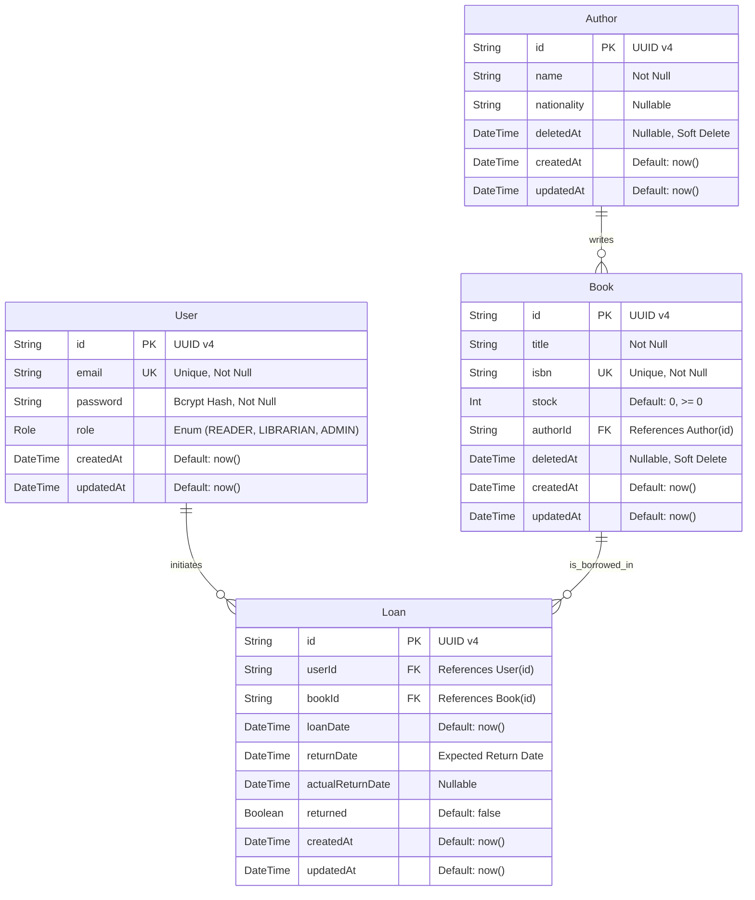

# Documento de Arquitetura e Modelagem de Dados (SDD) - BookStore Library

Este documento detalha o design do banco de dados relacional e a arquitetura de dados do **BookStore Library**, mapeando as necessidades de negócio especificadas no PRD e nas Histórias de Usuário para um modelo relacional robusto.

---

## 1. Diagrama Entidade-Relacionamento (ERD)

Abaixo está o modelo relacional das entidades em formato Mermaid. Ele demonstra as chaves primárias, chaves estrangeiras, campos obrigatórios e a cardinalidade dos relacionamentos.



---

## 2. Dicionário de Entidades (Data Dictionary)

Abaixo está a especificação completa de cada tabela a ser implementada no banco de dados através do Prisma ORM.

### A. Tabela `User` (Usuários)
Gerencia as contas dos usuários do sistema e define seus papéis de controle de acesso (RBAC).

| Campo | Tipo no Prisma / DB | Restrições | Padrão | Descrição |
| :--- | :--- | :--- | :--- | :--- |
| `id` | `String` (UUID) | Primary Key | `uuid()` | Identificador único gerado automaticamente. |
| `email` | `String` | Unique, Not Null | - | E-mail do usuário utilizado como credencial única de login. |
| `password` | `String` | Not Null | - | Senha do usuário criptografada usando hashing (bcrypt). |
| `role` | `Enum` (`Role`) | Not Null | `READER` | Nível de acesso. Valores: `READER` (Leitor), `LIBRARIAN` (Bibliotecário), `ADMIN`. |
| `createdAt` | `DateTime` | Not Null | `now()` | Timestamp de quando a conta foi registrada. |
| `updatedAt` | `DateTime` | Not Null, AutoUpdate | `now()` | Timestamp da última modificação dos dados da conta. |

### B. Tabela `Author` (Autores)
Representa os autores cujos livros estão catalogados no acervo.

| Campo | Tipo no Prisma / DB | Restrições | Padrão | Descrição |
| :--- | :--- | :--- | :--- | :--- |
| `id` | `String` (UUID) | Primary Key | `uuid()` | Identificador único gerado automaticamente. |
| `name` | `String` | Not Null | - | Nome completo do autor. |
| `nationality` | `String` | Nullable | - | País de origem ou nacionalidade do autor. |
| `deletedAt` | `DateTime` | Nullable | - | Timestamp para exclusão lógica (soft delete). Se não nulo, o registro está oculto das consultas públicas. |
| `createdAt` | `DateTime` | Not Null | `now()` | Registro cronológico de inserção do autor. |
| `updatedAt` | `DateTime` | Not Null, AutoUpdate | `now()` | Timestamp da última modificação do autor. |

### C. Tabela `Book` (Livros)
Representa os títulos literários físicos mantidos pela biblioteca.

| Campo | Tipo no Prisma / DB | Restrições | Padrão | Descrição |
| :--- | :--- | :--- | :--- | :--- |
| `id` | `String` (UUID) | Primary Key | `uuid()` | Identificador único do livro. |
| `title` | `String` | Not Null | - | Título da obra catalogada. |
| `isbn` | `String` | Unique, Not Null | - | Código padrão internacional do livro (ISBN). Único no banco. |
| `stock` | `Int` | Not Null | `0` | Quantidade de cópias físicas disponíveis em prateleira. Deve ser `>= 0`. |
| `authorId` | `String` (UUID) | Foreign Key, Not Null | - | Chave estrangeira que aponta para o autor em `Author.id`. |
| `deletedAt` | `DateTime` | Nullable | - | Timestamp para exclusão lógica (soft delete). Se não nulo, o livro está oculto. |
| `createdAt` | `DateTime` | Not Null | `now()` | Data de inserção do livro no catálogo. |
| `updatedAt` | `DateTime` | Not Null, AutoUpdate | `now()` | Timestamp da última modificação dos metadados da obra. |

### D. Tabela `Loan` (Empréstimos)
Representa a circulação das obras, vinculando leitores e livros de forma temporal.

| Campo | Tipo no Prisma / DB | Restrições | Padrão | Descrição |
| :--- | :--- | :--- | :--- | :--- |
| `id` | `String` (UUID) | Primary Key | `uuid()` | Identificador único da transação de empréstimo. |
| `userId` | `String` (UUID) | Foreign Key, Not Null | - | Chave estrangeira apontando para o leitor em `User.id`. |
| `bookId` | `String` (UUID) | Foreign Key, Not Null | - | Chave estrangeira apontando para o livro emprestado em `Book.id`. |
| `loanDate` | `DateTime` | Not Null | `now()` | Data/hora em que a transação foi aprovada e o livro saiu da biblioteca. |
| `returnDate` | `DateTime` | Not Null | - | Data/hora limite de devolução recomendada (ex: `loanDate + 14 dias`). |
| `actualReturnDate`| `DateTime` | Nullable | - | Data/hora real em que o livro foi retornado. Nulo se ativo. |
| `returned` | `Boolean` | Not Null | `false` | Flag que controla o estado de conclusão do empréstimo. |
| `createdAt` | `DateTime` | Not Null | `now()` | Timestamp de registro no banco. |
| `updatedAt` | `DateTime` | Not Null, AutoUpdate | `now()` | Timestamp da última atualização da transação. |

---

## 3. Integridade e Regras de Negócio no Banco de Dados

Para garantir que as regras críticas descritas no PRD sejam mantidas íntegras no banco de dados relacional, adotam-se as seguintes restrições lógicas:

1. **Relação de Empréstimos (N:N Indireta)**: 
   - A tabela `Loan` atua como uma tabela de junção (*join table*) entre `User` e `Book`. Isso impede que o relacionamento seja direto, permitindo o armazenamento de metadados críticos como `loanDate`, `returned` e `actualReturnDate`.
2. **Índices de Busca Rápida**:
   - Criação de índice composto em `Loan` na coluna `(userId, returned)` para acelerar a consulta crítica de contagem de empréstimos pendentes (`prisma.loan.count({ where: { userId, returned: false } })`).
   - Índice em `Book(isbn)` e `User(email)` para otimização de validações exclusivas durante a inserção.
3. **Soft Delete**:
   - Para as tabelas `Book` e `Author`, a exclusão física é substituída pela lógica (Soft Delete).
   - O campo `deletedAt` registrará o momento da exclusão. Se o valor for `NULL`, o registro está ativo.
   - Isso garante que registros históricos de empréstimos na tabela `Loan` não tenham suas chaves estrangeiras (`bookId`) corrompidas ou quebradas, mantendo a consistência dos dados históricos.
4. **Validação Crítica de Circulação (Overdue and Active Limits)**:
   - Antes de permitir qualquer empréstimo (`POST /loans`), a camada de serviço (`loans.service.ts`) deve validar se:
     1. O leitor possui menos de 4 empréstimos ativos (`returned = false`).
     2. O leitor não possui nenhum empréstimo ativo (`returned = false`) em atraso (onde `returnDate < agora`).
5. **Estratégia de População Inicial (Prisma Seeding)**:
   - A criação inicial de contas na rota `/auth/register` é permitida somente para a role `READER`.
   - Para gerar as contas com privilégios administrativos (`ADMIN` e `LIBRARIAN`), utiliza-se o script de seed do Prisma (`prisma/seed.ts` executado via `prisma db seed`).
   - O script de seed deve garantir a existência de pelo menos um usuário `ADMIN` e um `LIBRARIAN` padrão (com hashes bcrypt pré-calculados).
6. **Restrições Relacionais (OnDelete/OnUpdate)**:
   - **Exclusão de Autor (`Author` -> `Book`)**: `ON DELETE RESTRICT`. Um autor não pode ter seu registro deletado (mesmo logicamente se houver validação) se existirem livros ativos associados a ele, prevenindo órfãos no catálogo.
   - **Exclusão de Livros/Usuários (`Book`/`User` -> `Loan`)**: `ON DELETE RESTRICT` na chave do banco para evitar deleções físicas acidentais que violassem chaves estrangeiras ativas.

---

## 4. Contratos de API (REST API Endpoints)

Todas as requisições para rotas privadas exigem o cabeçalho HTTP `Authorization: Bearer <JWT>`. A API segue o padrão arquitetural REST e formata os retornos através de Interceptores e Filtros de Exceção Globais.

### A. Padronização dos Envelopes JSON

#### Resposta de Sucesso Padrão (200 OK / 201 Created)
```json
{
  "success": true,
  "data": { ... },
  "meta": {
    "page": 1,
    "limit": 10,
    "total": 100
  }
}
```

#### Resposta de Falha Padrão (400 Bad Request / 401 Unauthorized / 403 Forbidden / 404 Not Found)
```json
{
  "success": false,
  "statusCode": 400,
  "message": "Mensagem detalhada do erro ou array de validações do ValidationPipe",
  "timestamp": "2026-06-02T15:20:00.000Z",
  "path": "/api/v1/resource"
}
```

---

### B. Resumo da Tabela de Endpoints

| Módulo | Método | Endpoint | Acesso (RBAC) | Descrição |
| :--- | :--- | :--- | :--- | :--- |
| **Auth** | `POST` | `/auth/register` | Público | Cadastra um novo leitor (padrão `READER`). |
| **Auth** | `POST` | `/auth/login` | Público | Autentica credenciais e gera o token JWT. |
| **Autores** | `POST` | `/authors` | `LIBRARIAN`, `ADMIN` | Cadastra um novo autor no sistema. |
| **Autores** | `GET` | `/authors` | Público | Lista autores cadastrados (com busca e paginação). |
| **Autores** | `GET` | `/authors/:id` | Público | Exibe os detalhes de um autor e suas obras relacionadas. |
| **Autores** | `PUT` | `/authors/:id` | `LIBRARIAN`, `ADMIN` | Atualiza metadados de um autor. |
| **Autores** | `DELETE` | `/authors/:id` | `LIBRARIAN`, `ADMIN` | Remove um autor (bloqueado se houver livros). |
| **Livros** | `POST` | `/books` | `LIBRARIAN`, `ADMIN` | Cadastra um livro vinculado a um `authorId`. |
| **Livros** | `GET` | `/books` | Público | Lista livros cadastrados (com busca e paginação). |
| **Livros** | `GET` | `/books/:id` | Público | Exibe os detalhes de um livro específico e seu autor. |
| **Livros** | `PUT` | `/books/:id` | `LIBRARIAN`, `ADMIN` | Atualiza estoque, título ou informações da obra. |
| **Livros** | `DELETE` | `/books/:id` | `LIBRARIAN`, `ADMIN` | Remove um livro (bloqueado se houver histórico de empréstimo). |
| **Empréstimos**| `POST` | `/loans` | `READER`, `LIBRARIAN`, `ADMIN` | Solicita o empréstimo de um livro. |
| **Empréstimos**| `GET` | `/loans` | `LIBRARIAN`, `ADMIN` (todos) / `READER` (próprios) | Lista transações de empréstimo ativas e históricas. |
| **Empréstimos**| `PATCH` | `/loans/:id/return`| `LIBRARIAN`, `ADMIN` | Registra a devolução física de uma obra alugada. |

---

### C. Detalhamento de Carga Útil (Payloads)

#### 1. Autenticação (`/auth`)

##### **POST `/auth/register`**
* **Input Payload (`RegisterUserDto`)**:
  ```json
  {
    "email": "estudante@universidade.edu.br",
    "password": "senha_segura_123"
  }
  ```
* **Output Payload (201 Created)**:
  ```json
  {
    "success": true,
    "data": {
      "id": "e8a609d5-78e2-45bb-bcf9-4e0d4cbb8f01",
      "email": "estudante@universidade.edu.br",
      "role": "READER",
      "createdAt": "2026-06-02T15:20:00.000Z"
    }
  }
  ```

##### **POST `/auth/login`**
* **Input Payload (`LoginDto`)**:
  ```json
  {
    "email": "estudante@universidade.edu.br",
    "password": "senha_segura_123"
  }
  ```
* **Output Payload (200 OK)**:
  ```json
  {
    "success": true,
    "data": {
      "accessToken": "eyJhbGciOiJIUzI1NiIsInR5cCI6IkpXVCJ9..."
    }
  }
  ```

---

#### 2. Autores (`/authors`)

##### **POST `/authors`**
* **Input Payload (`CreateAuthorDto`)**:
  ```json
  {
    "name": "J.R.R. Tolkien",
    "nationality": "Britânico"
  }
  ```
* **Output Payload (201 Created)**:
  ```json
  {
    "success": true,
    "data": {
      "id": "fa2c4d62-5a21-4f11-9fa2-581907cb591a",
      "name": "J.R.R. Tolkien",
      "nationality": "Britânico",
      "createdAt": "2026-06-02T15:21:00.000Z"
    }
  }
  ```

---

#### 3. Livros (`/books`)

##### **POST `/books`**
* **Input Payload (`CreateBookDto`)**:
  ```json
  {
    "title": "O Senhor dos Anéis: A Sociedade do Anel",
    "isbn": "978-8578270698",
    "stock": 5,
    "authorId": "fa2c4d62-5a21-4f11-9fa2-581907cb591a"
  }
  ```
* **Output Payload (201 Created)**:
  ```json
  {
    "success": true,
    "data": {
      "id": "bcd7e8a9-4b2a-4311-8e9a-4c28bb0f1a23",
      "title": "O Senhor dos Anéis: A Sociedade do Anel",
      "isbn": "978-8578270698",
      "stock": 5,
      "authorId": "fa2c4d62-5a21-4f11-9fa2-581907cb591a",
      "createdAt": "2026-06-02T15:22:00.000Z"
    }
  }
  ```

##### **GET `/books`**
* **Parâmetros de Consulta (Query)**: `?page=1&limit=10&search=Sociedade`
* **Output Payload (200 OK)**:
  ```json
  {
    "success": true,
    "data": [
      {
        "id": "bcd7e8a9-4b2a-4311-8e9a-4c28bb0f1a23",
        "title": "O Senhor dos Anéis: A Sociedade do Anel",
        "isbn": "978-8578270698",
        "stock": 5,
        "author": {
          "id": "fa2c4d62-5a21-4f11-9fa2-581907cb591a",
          "name": "J.R.R. Tolkien"
        }
      }
    ],
    "meta": {
      "page": 1,
      "limit": 10,
      "total": 1
    }
  }
  ```

---

#### 4. Empréstimos (`/loans`)

##### **POST `/loans`**
* **Input Payload (`CreateLoanDto`)**:
  ```json
  {
    "bookId": "bcd7e8a9-4b2a-4311-8e9a-4c28bb0f1a23"
  }
  ```
* **Output Payload (201 Created)**:
  ```json
  {
    "success": true,
    "data": {
      "id": "14f2e9d8-9a4b-4831-90fa-bcdf87e21a45",
      "userId": "e8a609d5-78e2-45bb-bcf9-4e0d4cbb8f01",
      "bookId": "bcd7e8a9-4b2a-4311-8e9a-4c28bb0f1a23",
      "loanDate": "2026-06-02T15:23:00.000Z",
      "returnDate": "2026-06-16T15:23:00.000Z",
      "returned": false
    }
  }
  ```

##### **PATCH `/loans/:id/return`**
* **Input Payload**: Nenhum (parâmetros da rota `id` identificam a transação)
* **Output Payload (200 OK)**:
  ```json
  {
    "success": true,
    "data": {
      "id": "14f2e9d8-9a4b-4831-90fa-bcdf87e21a45",
      "userId": "e8a609d5-78e2-45bb-bcf9-4e0d4cbb8f01",
      "bookId": "bcd7e8a9-4b2a-4311-8e9a-4c28bb0f1a23",
      "loanDate": "2026-06-02T15:23:00.000Z",
      "returnDate": "2026-06-16T15:23:00.000Z",
      "actualReturnDate": "2026-06-03T10:15:00.000Z",
      "returned": true
    }
  }
  ```

